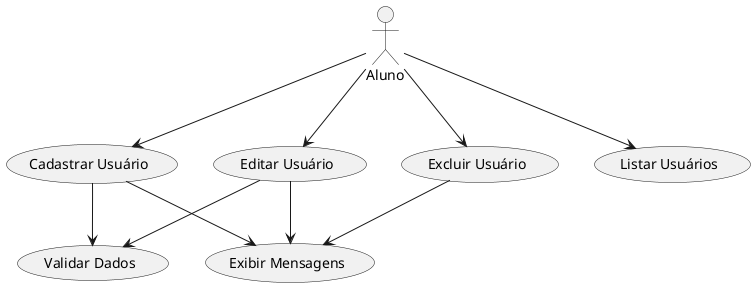
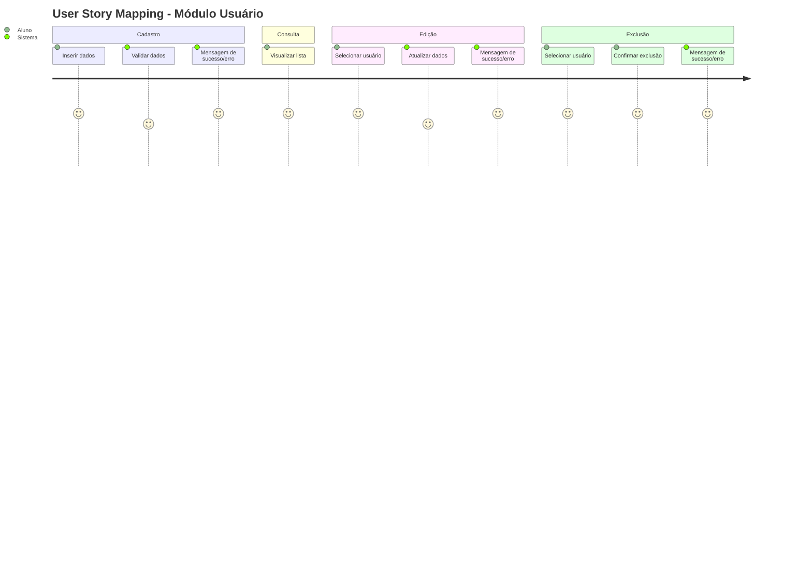

## 1. Tipo de projeto

**Backend** (Node.js + Express + TypeScript)

## 2. Requisitos Funcionais

-   Cadastro de usuários (nome, e-mail, senha)
-   Listagem de usuários
-   Edição de usuários
-   Exclusão de usuários
-   Validação de e-mail único e formato válido
-   Validação de senha mínima de 6 caracteres
-   Mensagens claras de erro

## 3. Requisitos Não Funcionais

-   Banco de dados SQLite
-   API REST documentada com Swagger/OpenAPI
-   CRUD com resposta até 2 segundos
-   Suporte a 20 usuários simultâneos
-   Código modular e tratamento de erros

## 4. Atores / Envolvidos

-   **Professor** (avaliador)
-   **Alunos da sala** (testadores)
-   **Desenvolvedor** (autor do projeto)

---

## 5. Modelagem de Casos de Uso

### Descrição textual

-   **Ator:** Aluno/Usuário
-   **Objetivo:** Gerenciar usuários no sistema
-   **Casos de Uso:**

    1. Cadastrar usuário
    2. Listar usuários
    3. Editar usuário
    4. Excluir usuário
    5. Validar dados (e-mail único, formato, senha)
    6. Exibir mensagens de erro ou sucesso

### Diagrama Mermaid

```mermaid
usecaseDiagram
    actor Aluno
    Aluno --> (Cadastrar Usuário)
    Aluno --> (Listar Usuários)
    Aluno --> (Editar Usuário)
    Aluno --> (Excluir Usuário)
    (Cadastrar Usuário) --> (Validar Dados)
    (Editar Usuário) --> (Validar Dados)
    (Cadastrar Usuário) --> (Exibir Mensagens)
    (Editar Usuário) --> (Exibir Mensagens)
    (Excluir Usuário) --> (Exibir Mensagens)
```

### Código PlantUML



---

## 6. User Story Mapping

### Fluxo de valor (Big Story)

> Como usuário do sistema, quero gerenciar meus registros de forma segura e eficiente, incluindo cadastro, listagem, edição e exclusão, garantindo validações e mensagens claras.

### Backbone / Épicos

1. **Cadastro**
2. **Consulta**
3. **Edição**
4. **Exclusão**
5. **Mensagens / Erros**

### Estórias detalhadas

-   **Cadastro:**

    -   Inserir nome, e-mail e senha
    -   Validar e-mail único e formato
    -   Validar senha mínima de 6 caracteres
    -   Receber confirmação ou mensagem de erro

-   **Consulta:**

    -   Visualizar lista completa de usuários

-   **Edição:**

    -   Selecionar usuário existente
    -   Atualizar dados com validação
    -   Receber confirmação ou mensagem de erro

-   **Exclusão:**

    -   Selecionar usuário existente
    -   Confirmar remoção
    -   Receber mensagem de sucesso ou erro

-   **Mensagens / Erros:**

    -   Centralizar tratamento de erros
    -   Exibir mensagens claras e consistentes

### Priorização por incrementos

-   **Incremento 1:** Cadastro de usuários com validação
-   **Incremento 2:** Listagem de usuários
-   **Incremento 3:** Edição de usuários com validação
-   **Incremento 4:** Exclusão de usuários e mensagens de erro centralizadas

---

## 7. Boundaries / Contextos / Módulos (sugeridos automaticamente)

-   **Módulo Usuário**

    -   Cadastro (criação de usuário + validação)
    -   Consulta (listagem de usuários)
    -   Edição (atualização de dados com validação)
    -   Exclusão (remoção de registros)
    -   Mensagens / Erros (tratamento centralizado de mensagens de sucesso e erro)

> Observação: todos os módulos estão agrupados logicamente dentro do Módulo Usuário, facilitando manutenção e escalabilidade.

---

## 8. Diagrama visual do User Story Mapping (Mermaid)


